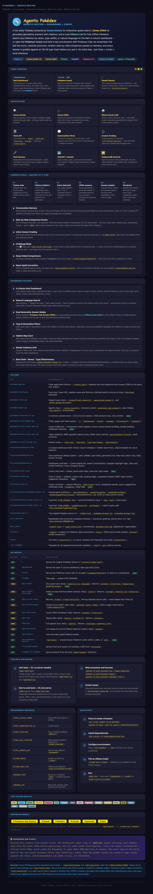

# Agentic Pokédex

A Pokédex dashboard backed by Coveo search, Coveo Relevance Generative Answering (CRGA), and a local Ollama fallback. Ask about Pokémon matchups in natural language; get grounded answers with citations, type-effectiveness chips, and encounter maps.



> **Styled README** — available at [`/readme`](http://127.0.0.1:5003/readme) when the app is running.

---

## Quick start

```bash
git clone <repo>
cd <repo>
pip install -r requirements-dev.txt
cp .env.example .env          # fill in your Coveo + Ollama credentials
make run                      # starts on http://127.0.0.1:5003
open http://127.0.0.1:5003/dashboard
```

---

## Repository map

| Directory / file | Contents |
|---|---|
| `pokedex/` | Flask application package — `app.py` (factory), `config.py` (settings), `coveo.py` (CoveoClient + SSE parser), `agent.py` (Ollama RAG loop), `ollama_client.py`, `routes/` (blueprints) |
| `frontend/` | Browser-side assets — `dashboard.js/.html/.css`, `classic/` (original device UI), `modules/` (type-colors.js, type-chart.js) |
| `tests/` | `unit/` (pytest, no server needed), `e2e/` (Playwright against a live server) |
| `eval_harness/` | Repeatable wild-encounter evaluation — draws scenarios from the live Coveo index, grades answers against a type chart, stores everything in SQLite |
| `eval_data/` | `corpus.json` + `type_cache.json` (committed); `pokedex_eval.db` (gitignored, regenerable) |
| `scripts/` | `ingest/` (one-off scraper for Pokémon DB + artwork), `coveo/` (CRGA probe scripts), `mlflow/` (LLM comparison) |
| `data/` | `pokemon_db.csv` (scraped Pokédex), `images/` (artwork) |
| `docs/` | `architecture.md`, `known-issues.md`, `plans/` |
| `artifacts/` | Generated outputs (gitignored) |

---

## Running the eval harness

```bash
make run &                                    # start the app
python -m eval_harness run --label baseline   # run an evaluation
python -m eval_harness report                 # scoreboard
python -m eval_harness regrade --run 1        # re-score stored answers
```

See [`eval_harness/README.md`](eval_harness/README.md) for full documentation.

---

## Running the tests

```bash
make test-unit    # unit tests — no server needed
make run &        # start the server
make test-e2e     # Playwright e2e tests against the running server
```

---

## Architecture

See [`docs/architecture.md`](docs/architecture.md) for a detailed walkthrough of the request flow, the two RGA paths, how Pokémon data is sourced, and the Semantic-PokEncoder.
